# skills

A collection of [agent skills](https://docs.anthropic.com/en/docs/claude-code/skills) for an **idea-to-merge workflow** built around an organisation knowledge base, GitHub issues/PRs, and Notion. Each skill is a self-contained `SKILL.md` (plus any bundled references) that an agent loads on demand.

The skills are designed to chain: an idea is interviewed into a brief, specced into a PRD, sliced into buildable tasks, built, and reviewed — with a human gating each major step and GitHub **labels** carrying state between them.

## Skills in this repo

Skills live under a category directory (`skills/<category>/<name>/`): **engineering** (the idea-to-merge build pipeline), **utility** (standalone tools), and **productivity** (routines that speed a human or agent up).

| Skill | Category | Role | Output |
| --- | --- | --- | --- |
| [`ideate`](skills/engineering/ideate/SKILL.md) | engineering | **Front door.** Interviews the user one question at a time in plain, non-technical language (grill-style), sharpening domain terms and updating `CONTEXT.md`/ADRs inline. Then classifies and routes the idea. | A lean `type:brief` issue (or an append / close / triage) |
| [`create-prd`](skills/engineering/create-prd/SKILL.md) | engineering | **Spec writer.** Takes an issue number or auto-searches `type:brief` + `state:prd-ready` briefs, investigates the codebase in a sub-agent, and publishes a durable PRD as a **new** artifact in the brief's store — then retires the brief (closed/archived, cross-linked). Open questions become a marked comment + `state:human-review-needed` on the brief. Sits between `ideate` and `implement-issue`. | A `type:prd` issue/page (problem, user stories, decisions, seams) |
| [`slice-prd`](skills/engineering/slice-prd/SKILL.md) | engineering | **Work slicer.** Takes a `type:prd` issue number or auto-searches `type:prd` + `state:slice-ready` PRDs, investigates the codebase in a sub-agent, then interviews the user to set granularity and breaks the PRD into **tracer-bullet** child issues (each cutting through every layer). Clear slices get `state:sliced`; ambiguous ones get `state:human-review-needed`. The PRD stays open as an epic. Sits between `create-prd` and `implement-issue`. | `type:task` child issues with Ready/Acceptance/Done checklists, linked to the PRD + brief |
| [`implement-issue`](skills/engineering/implement-issue/SKILL.md) | engineering | **Implementer.** Takes a `type:task` number (or auto-searches `type:task` + `state:agent-ready`), claims each with `state:building`, builds it **test-first** on a feature branch, and opens a PR (labelled `state:review-ready`) that closes the issue. On a later run — issue already marked, or given a PR — it reads `review-pr`'s findings and **reworks** the PR to address them, then hands back for re-review. Parks what it can't finish (`state:blocked` / `state:human-review-needed`). Loops with `review-pr` until merge-ready. | A feature-branch PR, built and reworked to merge-ready |
| [`review-pr`](skills/engineering/review-pr/SKILL.md) | engineering | **Gatekeeper.** Reviews a diff (or a `state:review-ready` PR) on two independent axes — **Standards** and **Spec** — using parallel sub-agents, **aligns each finding's disposition with the user interview-style**, then posts the marked comment and outcome label. Never edits code — fixes go to `implement-issue` via `state:blocked`. | A side-by-side report + agreed PR comment + state label |
| [`write-a-skill`](skills/productivity/write-a-skill/SKILL.md) | productivity | **Skill smith.** Interviews the user one question at a time (ideate-style), places the new skill among the existing ones, and drafts a `SKILL.md` against a house contract — token-lean, plainly worded, caveman-terse internally. | A new org-style `SKILL.md` (plus refs/scripts if needed) |
| [`knowledge-base`](skills/productivity/knowledge-base/SKILL.md) | productivity | **KB bootstrapper & caretaker.** Interviews the user to pick a backend (GitHub, Notion, local, or hybrid), records the choice, scaffolds the full idea-to-merge structure (pipeline labels / databases / numbered folders + AGENTS.md), installs a detect-and-offer hook, and stays on as owner of the *structure*. The thing that builds the `ORG_KB` every other skill assumes. | A live knowledge base + `kb-config.yml` |
| [`ast-grep`](skills/utility/ast-grep/SKILL.md) | utility | **Shared tool.** Structural code search with [ast-grep](https://ast-grep.github.io/). The other skills use `ast-grep` (`sg`) for **all code search** in place of `grep`. | — (referenced by the others) |

> `security-review` is referenced by the workflow below but is **not** part of this repo — it's a sibling tool in the broader pipeline.

## The workflow

```mermaid
flowchart LR
    idea([Raw idea]) --> ideate

    subgraph ideate["🦫 ideate"]
        interview[Interview the user] --> classify[Classify] --> brief[Write lean brief]
    end

    brief --> briefgate{{"Human applies<br/>state:prd-ready"}}
    briefgate -->|gated| createprd

    subgraph createprd["📐 create-prd"]
        investigate[Investigate codebase] --> seams[Resolve open questions] --> prd[Write durable PRD]
    end

    seams -. open questions .-> attention[/state:human-review-needed/]
    attention -. ideate-style interview .-> briefgate
    prd --> slicegate{{"Human applies<br/>state:slice-ready"}}
    slicegate -->|gated| sliceprd

    subgraph sliceprd["🔪 slice-prd"]
        slices[Draft tracer-bullet slices] --> coarseness[Set coarseness w/ user] --> children[Publish child issues]
    end

    children --> gate{{"Human applies<br/>state:agent-ready<br/>(per child)"}}
    children -. ambiguous slice .-> attention
    gate -->|gated| build

    subgraph build["👷 implement-issue"]
        claim[Claim w/ state:building] --> tdd[TDD red-green-refactor] --> openpr[Open PR]
    end

    build -. blocked .-> blocked
    build -. needs judgement .-> attention
    openpr --> pr([Pull request])
    pr --> reviewgate{{"build labels PR<br/>state:review-ready"}}
    reviewgate -->|triggers| review

    subgraph review["🔎 review-pr"]
        standards[Standards axis] & spec[Spec axis]
    end

    review -. align findings w/ user .-> review
    review -->|clean| ready[/state:merge-ready/]
    review -->|fix agreed| blocked[/state:blocked/]
    review -->|needs a human| human[/state:human-review-needed/]
    blocked -. implement-issue reworks .-> build
```



1. **Ideate.** A raw idea enters through `ideate`. It interviews the user until there's shared understanding, classifies the idea, and — for valid bugs/features — writes a **lean brief** (`type:brief` issue). Glossary terms and ADRs are updated inline as decisions land. Duplicates and user-errors are closed (with confirmation); valid-but-unshaped ideas are parked **untyped** with `state:human-review-needed` for a human to triage.
2. **Spec.** A human gates a brief for speccing with **`state:prd-ready`**. `create-prd` then picks it up — by issue number (`create prd 250`) or by auto-searching `type:brief` + `state:prd-ready` in batch — investigates the codebase in a sub-agent, and writes a **durable PRD** (`type:prd` issue) of *decisions* rather than file paths, which rot. The PRD is a **new** artifact in the brief's own store; once it's posted, the brief is **retired** — closed (GitHub) / archived (Notion) / moved to an archive folder (local KB), cross-linked both ways — so the pipeline carries exactly one live artifact. If a blocking question surfaces it never guesses: with a human present it resolves it through an **`ideate`-style interview** (one question at a time, recommending answers, updating the brief inline) that carries the brief to `state:prd-ready`; in batch with no human, it parks the brief with a marked comment + **`state:human-review-needed`** (swapping off `state:prd-ready`) for that interview to happen later. It **never** applies `state:agent-ready`.
3. **Slice gate + slicing.** A human reviews the PRD and applies **`state:slice-ready`** (a human-only gate). `slice-prd` then picks it up — by number (`slice prd 250`) or by auto-searching `type:prd` + `state:slice-ready` in batch — investigates the codebase in a sub-agent, interviews the user to set granularity, and breaks the PRD into **tracer-bullet** `type:task` child issues (each a thin vertical slice through every layer, with detailed Definition of Ready / Acceptance Criteria / Definition of Done). Clear, buildable slices get **`state:sliced`**; ambiguous ones get **`state:human-review-needed`**. The PRD **stays open as the epic** until its children merge. It **never** applies `state:agent-ready`.
4. **Human gate.** A human reviews each `state:sliced` child issue and applies **`state:agent-ready`**. This label is a deliberate human-only gate — **agents never apply it.** Nothing gets built until a person says so.
5. **Build.** `implement-issue` picks up gated issues — by number (`implement 250`) or by auto-searching `type:task` + `state:agent-ready` in batch — **claims** each by swapping `state:agent-ready` → `state:building` (so nothing double-picks it), then builds it **test-first** (red-green-refactor through the issue's Acceptance Criteria) on a feature branch and opens a PR that closes the issue. It hands off to review **by label** — it tags the PR **`state:review-ready`** rather than calling `review-pr` directly, and drops its own marker comment on the issue so a later run knows a PR exists. A build it can't finish is parked: `state:blocked` for a hard technical failure, `state:human-review-needed` for one needing a person's judgement — and a human re-applies `state:agent-ready` to authorise a retry. It **never** applies `state:agent-ready` itself.
6. **Review.** `review-pr` picks up PRs carrying **`state:review-ready`** (or a fixed point a user names) and reviews the diff on two axes that can pass/fail independently — **Standards** (does it follow documented coding standards?) and **Spec** (does it implement what the issue/PRD/ADR asked for?). It does **not** auto-post: it **aligns each finding's disposition with the user interview-style** (one question at a time, recommending an answer), then posts the agreed `🔎 review-pr-agent` comment, consumes `state:review-ready`, and tags the PR (`state:merge-ready` clean / `state:blocked` fix agreed / `state:human-review-needed`). It never edits code.
7. **Rework.** A `state:blocked` PR loops back: `implement-issue` (given the PR, or re-run on the now-marked issue) reads `review-pr`'s findings, reworks **test-first**, pushes, and re-labels the PR `state:review-ready` for re-review. Build → review → rework repeats until the PR is `state:merge-ready` and a human merges.

## Installation

These skills install with [`npx skills`](https://github.com/vercel-labs/skills) (the open agent-skills CLI; works with Claude Code, Codex, Cursor, and others). It auto-detects which agents you have installed.

```bash
# Install everything from this repo
npx skills add itisparas/skills

# See what's available first
npx skills add itisparas/skills --list

# Install a single skill
npx skills add itisparas/skills --skill ideate

# Install for all your agents, no prompts, copy instead of symlink
npx skills add itisparas/skills --all -y --copy

# Global install (user directory) instead of per-project
npx skills add itisparas/skills -g
```

<details>
<summary>Manual install (symlink)</summary>

```bash
# Claude Code — per project
ln -s "$PWD/skills/engineering/ideate"        .claude/skills/ideate
ln -s "$PWD/skills/engineering/create-prd"    .claude/skills/create-prd
ln -s "$PWD/skills/engineering/slice-prd"     .claude/skills/slice-prd
ln -s "$PWD/skills/engineering/implement-issue" .claude/skills/implement-issue
ln -s "$PWD/skills/engineering/review-pr"     .claude/skills/review-pr
ln -s "$PWD/skills/productivity/write-a-skill" .claude/skills/write-a-skill
ln -s "$PWD/skills/utility/ast-grep"          .claude/skills/ast-grep

# …or globally
ln -s "$PWD/skills/engineering/ideate"    ~/.claude/skills/ideate
```

For Codex CLI and other runners, place the skill folders under that tool's skills directory (commonly `.agents/skills/`).
</details>

## Requirements

- **[ast-grep](https://ast-grep.github.io/)** (`sg`) — `brew install ast-grep`. Used for all code search.
- **`gh` CLI**, authenticated (`gh auth status`) — issues, labels, PR comments.
- **Notion MCP** configured for your organisation — see the setup block in each skill's prerequisites.
- **`ORG_KB`** environment variable pointing at the organisation knowledge base (e.g. `export ORG_KB=./`).

## Labels

**Every branch, route, and hand-off in this workflow is decided by a label, and every agent comment is stamped with a marker — nothing is inferred from prose.** A skill picks up work because an issue carries a label, advances it by swapping labels, and asks for a human by applying one. Human decision points are *always* a human-only label (`state:prd-ready`, `state:slice-ready`, `state:agent-ready`) that agents read but never apply. This is what keeps the pipeline auditable and the human gates real: the label *is* the contract, and these tables are its single source of truth.

### Label lifecycle

Labels are how work moves down the pipeline. A piece of work changes *type* as it's refined (`brief` → `prd` → `task`) and pauses at a *human gate* between each stage — a `state:*` label only a person applies. Reading top to bottom is the full journey of one idea:

| Stage | The live issue carries | Set by | To advance, a human applies | Picked up by |
| --- | --- | --- | --- | --- |
| **Idea → brief** | `type:brief` (+ `Bug`/`Feature`, `area:*`/`topic:*`) | `ideate` | `state:prd-ready` | `create-prd` |
| **Brief → PRD** | `type:prd` (the brief is retired/closed) | `create-prd` | `state:slice-ready` | `slice-prd` |
| **PRD → tasks** | `type:task` + `state:sliced`, one per slice (the PRD stays open as the epic) | `slice-prd` | `state:agent-ready` (per task) | `implement-issue` |
| **Task → build** | `type:task` + `state:building` (claimed; `state:agent-ready` removed) | `implement-issue` | — (the agent builds it now) | `implement-issue` |
| **Build → PR** | the PR carries `state:review-ready` (and closes its task issue) | `implement-issue` | — (the label triggers review) | `review-pr` |
| **Review** | the PR carries `state:blocked` (fix) / `state:merge-ready` (clean) / `state:human-review-needed` | `review-pr` (after aligning findings with the user) | — (a `state:blocked` PR loops back to rework) | `implement-issue` (rework) / humans |
| **Rework → re-review** | the PR back at `state:review-ready` after rework | `implement-issue` | — (the label re-triggers review) | `review-pr` |
| **PR → merge** | `state:merge-ready` | `review-pr` | merge | humans |

**Detours off the happy path:** when a skill needs a person's judgement mid-stream — `create-prd` hits a blocking open question, or `slice-prd` produces an ambiguous slice — it applies **`state:human-review-needed`** (swapping off the gate label so batch mode skips it) and parks the issue until a human resolves it. `ideate` uses the **same** label for a valid idea that needs deeper analysis before it can become a brief — left **untyped**, so an untyped `state:human-review-needed` issue is the triage signal (vs a typed one, which is a parked in-flight artifact).

### Label reference

State flows through GitHub labels rather than through any shared database. The skills read and write these:

| Label | Meaning | Set by | Read by |
| --- | --- | --- | --- |
| `type:brief` | The issue is a brief produced by ideate | `ideate` | `ideate` (dedup), humans |
| `state:prd-ready` | **Human gate** — a brief is approved to be specced into a PRD. Agents **never** apply this. | Human only | `create-prd` (batch search) |
| `type:prd` | The issue is a PRD expanded from a brief | `create-prd` | `create-prd` (dedup), humans, `slice-prd` |
| `state:slice-ready` | **Human gate** — a PRD is approved to be sliced into tasks. Agents **never** apply this. | Human only | `slice-prd` (batch search) |
| `type:task` | The issue is a buildable child task sliced from a PRD | `slice-prd` | humans, `implement-issue` |
| `state:sliced` | A child task is clear and buildable, awaiting the human build gate. Not itself a build gate. | `slice-prd` | humans |
| `state:agent-ready` | **Human gate** — approved to build. Agents **never** apply this. | Human only | `implement-issue` (batch search) |
| `state:building` | A task is being actively built — claims it and drops it from the batch queue. Removed when it parks; retired with the issue when its PR closes it. | `implement-issue` | `implement-issue`, humans |
| `state:review-ready` | A **PR** is built (or reworked) and awaiting review — the hand-off from build to review. Set on first PR and after each rework round; consumed (removed) by `review-pr` when it posts its outcome. | `implement-issue` | `review-pr` (batch search), humans |
| `state:blocked` | A build can't finish, or review (with the user) agreed changes are needed before merge. On a PR it's the signal for `implement-issue` to rework. | `implement-issue`, `review-pr` | humans, `implement-issue` (rework pickup) |
| `state:merge-ready` | Both review axes are clean | `review-pr` | humans |
| `state:human-review-needed` | Findings, open questions, a raw idea needing triage, or a build needing judgement need human judgement (untyped issue = the `ideate` triage case) | `ideate`, `review-pr`, `create-prd`, `slice-prd`, `implement-issue` | humans |
| `area:*` / `topic:*` | Domain / subject classification | `ideate` | humans, routing |

Built-in GitHub **issue types** `Bug` and `Feature` are assigned by `ideate` based on classification.

## Comment markers

Every comment an agent posts begins with a marker line, so agent comments are always distinguishable from human ones — and from each other:

| Marker | Skill |
| --- | --- |
| `> **⚓️ ideate-agent**` | `ideate` |
| `> **📐 create-prd-agent**` | `create-prd` |
| `> **🔪 slice-prd-agent**` | `slice-prd` |
| `> **👷 implement-issue-agent**` | `implement-issue` |
| `> **🔎 review-pr-agent**` | `review-pr` |
| `> **🔒 security-review-agent**` | `security-review` |
| `> **🧭 knowledge-base-agent**` | `knowledge-base` |

When [`write-a-skill`](skills/productivity/write-a-skill/SKILL.md) authors a new skill that posts comments, it assigns that skill its own distinct marker (e.g. `> **🛠️ <skill>-agent**`) and records it here — this table stays the single source of truth, so no two skills share a marker.

## Conventions

- **Labels and markers are the control plane** — every branch, route, and human-attention hand-off is decided by a label, and every agent comment carries a marker. Skills don't infer state from prose; they read a label, act, and swap it. Human gates are always human-only labels. The **Labels** and **Comment markers** tables are the single source of truth, and `write-a-skill` enforces this on every new skill.
- **`ORG_KB`** — the organisation knowledge base (glossary in `CONTEXT.md` / `CONTEXT-MAP.md`, decisions in `docs/adr/` or Notion) is loaded **once** per run.
- **Token discipline** — load context once, search narrow (ast-grep for code, keyword search for prose), keep a stable prompt prefix for caching, and keep internal reasoning terse. None of this compression ever touches user-facing text, which stays plain and example-driven.
- **Plain language** — user-facing questions and reports assume a non-technical reader: everyday words, quick analogies, and concrete live examples over abstractions.

## Attribution

- The **`ast-grep`** skill is vendored from the official [ast-grep](https://ast-grep.github.io/) project (MIT-licensed) and lightly adapted.
- The **`ideate`** interview methodology is inspired by the `grill-me` and `grill-with-docs` skills.

## License

[MIT](LICENSE) © 2026 Paras Singla
